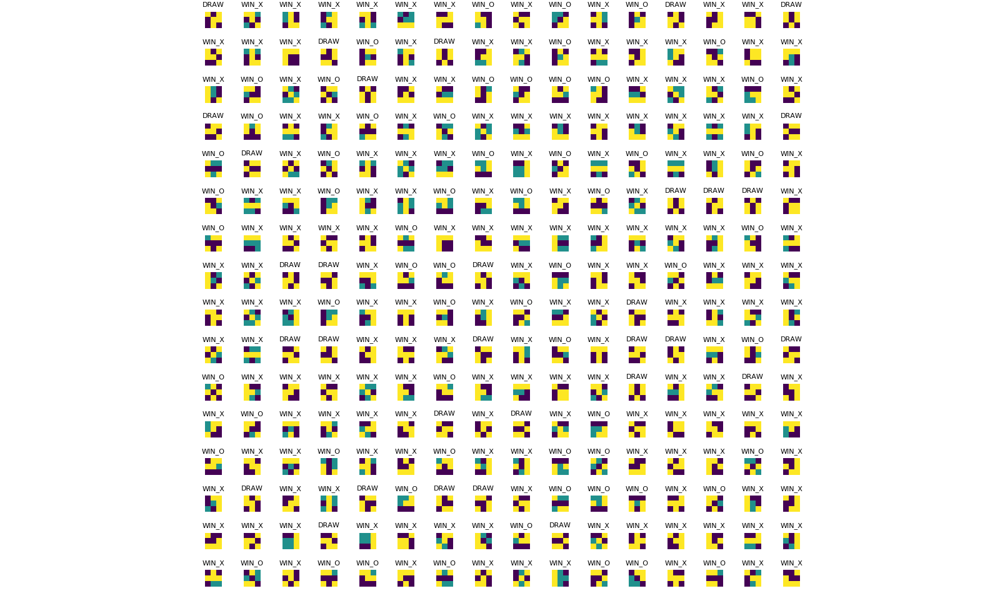

# Tic-tac-toe

Tic-tac-toe simulator leveraging [Mesa](https://mesa.readthedocs.io/en/master/overview.html).

Each player uses a random placement strategy. Repeated simulations demonstrate that, given this strategy, Player 1 has an advantage.

